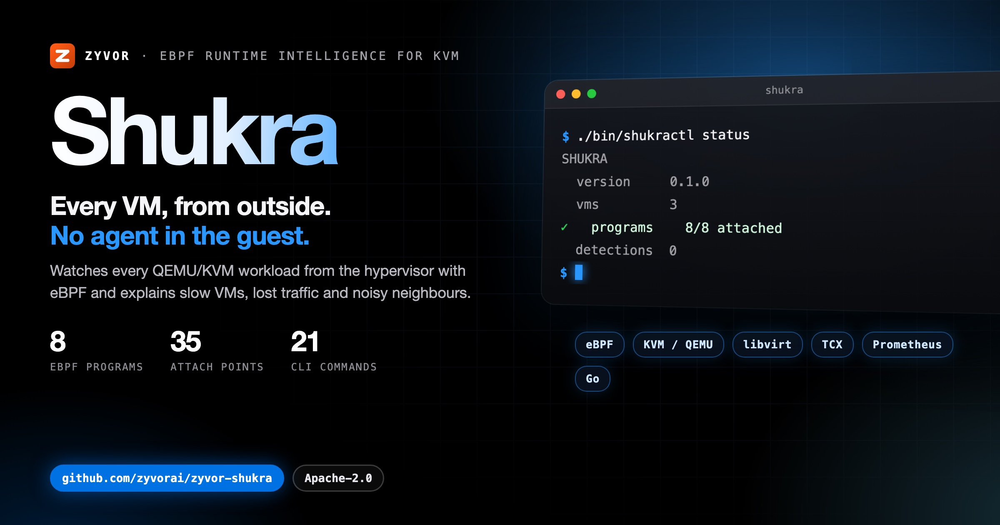

<div align="center">



# Shukra

### eBPF-powered runtime intelligence and security for KVM.

Shukra sits on the hypervisor and watches every QEMU/KVM workload from outside the guest.<br>
There is no agent to install in the VM. **Observe. Protect. Explain.**

[](https://github.com/zyvorai/zyvor-shukra/actions/workflows/ci.yml)
[](LICENSE)
[](#requirements)
[](#requirements)
[](#requirements)

[**Quick start**](#quick-start) · [**Tutorials**](docs/tutorials/README.md) · [**API**](docs/api.md) · [**All docs**](docs/index.md) · [**Product brochure (PDF)**](docs/sales/brochure/Zyvor-Shukra-Product-Brochure.pdf) · [**Changelog**](CHANGELOG.md)

</div>

---

## What Shukra is

The daemon attaches kernel traces, joins them to the QEMU process, and gives an operator a console and a CLI that say what they know, how they know it, and what they cannot see.

**8** eBPF programs · **35** kernel attach points · **0** agents in the guest · **17** console pages · **38** HTTP routes · **21** `shukractl` commands

<table>
  <tr>
    <td width="33%"><br><sub>Overview: what is attached, which VMs, what fired</sub></td>
    <td width="33%"><br><sub>Explain: ranked host-side causes with evidence</sub></td>
    <td width="33%"><br><sub>Contention: who took whose CPU</sub></td>
  </tr>
</table>

<sub>The screenshots are the console in fixture mode (`web/src/fixtures.ts`), not a live host. The [brochure](docs/sales/brochure/Zyvor-Shukra-Product-Brochure.pdf) walks a slow VM, a noisy neighbour, a past incident and lost traffic from start to finish.</sub>

<table>
<tr>
<td valign="top" width="33%">
<b>Explain</b><br>
Ranks the host-side causes of a slow VM over the last minute, each with its evidence and a list of what Shukra cannot see. It also answers for a past time, and writes an incident bundle for a ticket.<br>
<a href="docs/features.md">Features</a> · <a href="docs/tutorials/09-after-the-fact.md">After the fact</a>
</td>
<td valign="top" width="33%">
<b>Noisy neighbours and right-sizing</b><br>
Says who took whose CPU across VMs, and advises whether each VM is the right size. Advice is for a person; it never resizes anything.<br>
<a href="docs/signals.md#vcpu-preemption">Contention</a> · <a href="docs/signals.md#right-sizing">Right-sizing</a>
</td>
<td valign="top" width="33%">
<b>Guest traffic</b><br>
Sees what a guest sends on its own tap: connects, DNS query names and the server name in each TLS ClientHello, and what became of every TCP handshake.<br>
<a href="docs/tap.md">Guest traffic and isolation</a>
</td>
</tr>
<tr>
<td valign="top" width="33%">
<b>Where packets die</b><br>
Counts what the kernel dropped on each VM tap, by the kernel's own reason, and records host link, address, route and neighbor changes.<br>
<a href="docs/drops.md">Drops</a> · <a href="docs/netlink.md">Netlink</a>
</td>
<td valign="top" width="33%">
<b>VMM tripwires</b><br>
Watches every QEMU process, and what it started, for files it should never open and calls it should never make. Nothing to configure.<br>
<a href="docs/vmm-tripwires.md">VMM tripwires</a>
</td>
<td valign="top" width="33%">
<b>Guarded response</b><br>
Learns what a VM may connect to and audits it before it enforces, isolates a VM on approval, and audits Shukra itself with <code>shukractl doctor</code>.<br>
<a href="docs/egress-policy.md">Egress policy</a> · <a href="docs/responses.md">Responses</a> · <a href="docs/doctor.md">Doctor</a>
</td>
</tr>
</table>

| | |
|---|---|
| Daemon | `shukrad`: privileged, attaches traces, serves the API and console |
| CLI | `shukractl`: talks to the API only, never loads BPF |
| Console | `http://<hypervisor>:30970` |
| Module | `github.com/zyvorai/shukra` |
| License | [Apache-2.0](LICENSE) |

<a id="what-it-answers"></a>

## What it answers

| The question | Ask | Guide |
|---|---|---|
| Why is this VM slow right now? | `shukractl explain <vm>`: ranked host-side causes over the last minute, with evidence and a list of what Shukra cannot see | [Tutorial 4](docs/tutorials/04-shukractl.md) |
| Why *was* it slow at 03:12, hours ago? | `shukractl explain <vm> --at 2026-09-20T03:12:00Z`, and `shukractl incident <vm> --at -3h --out bundle.json` | [Tutorial 9](docs/tutorials/09-after-the-fact.md) |
| Which VM is the noisy neighbour? | `trace contention`, and `explain` (`noisy_neighbour`, `cpu_preempted`) | [Signals](docs/signals.md#vcpu-preemption) |
| Did the connection get an answer? | `trace tap`: accepted, refused, never answered or blocked, with the handshake time | [Lost traffic](docs/tutorials/08-lost-traffic.md) |
| Can I cut a compromised VM off without touching it? | `shukractl isolate <vm>` | [Guest traffic and isolation](docs/tap.md#isolate) |
| Is Shukra itself set up safely? | `shukractl doctor`: exposure, what is attached, what it cannot see, each with a fix | [Doctor](docs/doctor.md) |

All fifteen questions, with what to run for each: [What it answers](docs/what-it-answers.md).

<a id="what-it-does-not-do"></a>

## What it does not do

Read this before you trust it with anything.

- **Host TCP is QEMU's, not the guest's.** `tcp_v4_connect` and `tcp_v6_connect` events are `attribution: "qemu-process"` and `guest_attributed: false`. Only events seen on a VM's tap are `guest_attributed: true`. See [attribution](docs/attribution.md).
- **No agent, and no application data, with these exceptions.** Shukra never runs inside a guest and never reads what a guest says to the world. It reads four things beyond headers, and each has a switch: the name in a plain DNS query over UDP port 53 (`-dns-events=false`), the first segment of a TLS ClientHello (`-tls-events=false`), the names of the files a QEMU process opens, never their contents (`-vmm-tripwires=false`), and process names (`comm`).
- **Isolation is real, and conditional.** It really drops the VM's tap traffic, but only with an explicit management allow list (`-isolate-allow`), and only on Linux 6.6 or newer (TCX). Without an allow list it is refused.
- **Nothing acts unless you turn it on.** Responses, egress policy and baselines are off until you configure or apply them. A response can only isolate a VM, and by default it only proposes.
- **A VM Shukra cannot see says so.** User-mode networking has no tap, and `shukractl doctor` names it. **Percentiles can read up to 2x high**, because they come from log2 buckets.

The full list, with every caveat and what is not built yet: [What it does not do](docs/what-it-does-not-do.md).

## Requirements

| To get | You need |
|---|---|
| The daemon, CLI and API | Go 1.27+ to build (or a release tarball or `.deb`). Runs anywhere; programs are detached without BPF |
| The console | Node 22 to build it |
| `kvm`, `sched`, `block`, `net`, `vmm` | Linux with kernel BTF (`/sys/kernel/btf/vmlinux`), and `CAP_BPF` (5.8+) |
| `drops` | Linux 5.17+ (a drop reason on `kfree_skb`) |
| `tap`, guest traffic, egress policy and isolation | Linux 6.6+ (TCX), and `CAP_NET_ADMIN` |
| libvirt VMs' taps | `CAP_SYS_PTRACE` and `CAP_DAC_READ_SEARCH` |
| Building the programs | Linux with `clang` and `bpftool` |

A program the kernel cannot support reports itself `detached` with the reason, and the others still run. See [architecture](docs/architecture.md#kernel-requirements).

## Quick start

Go 1.27+ and Node 22 for the console.

```bash
make build
make web
./bin/shukrad -listen 127.0.0.1:30970 -web web/dist
./bin/shukractl status
```

If `SHUKRA_API_KEY` is unset, the daemon uses the dev token `shukra` and says so on stderr. Open `http://127.0.0.1:30970` and sign in with that token. On a Mac, or any host without BTF, programs stay detached; VM discovery from `/proc` still works. To attach traces you need Linux, clang, bpftool and kernel BTF: see [Attach traces](docs/tutorials/02-attach-traces.md).

Shukra is a systemd unit on the hypervisor, not a Helm chart: eBPF has to run where the VMs run. Deploy with `./scripts/deploy-remote.sh 10.0.1.5 sus`; the walkthrough, the operator loop, rules and flags are in [Getting started](docs/getting-started.md).

<a id="architecture"></a>

## Architecture

```text
┌──────────────────── hypervisor ────────────────────┐
│  VMM processes                 (guests untouched)  │
│      ▲ tap or host veth vh*                        │
│  kvm / sched / block / net / drops / vmm / tap     │  eBPF, CO-RE, maps + small rings
│              │                                     │
│           shukrad                                  │  identity, sampler, rules, responses, state, API
│         :30970 API                                 │
└──────────────┬─────────────────────────────────────┘
               │ bearer
       ┌───────┴────────┐
   shukractl         console
```

How identity, the tap program, history windows and detection fit together is in [architecture](docs/architecture.md); the short version is in [Architecture at a glance](docs/architecture-at-a-glance.md).

## Go deeper

- <a id="the-programs"></a>**The programs:** eight programs and their 35 attach points, and what each records — [docs/programs.md](docs/programs.md).
- <a id="features"></a>**Features:** every capability in one page — [docs/features.md](docs/features.md).
- <a id="deploy-a-hypervisor"></a><a id="operator-loop"></a>**Deploy and the operator loop:** [docs/getting-started.md](docs/getting-started.md).
- <a id="detection-rules"></a>**Detection rules:** one YAML file, validated with `shukractl rules check` — [docs/detection-rules.md](docs/detection-rules.md).
- <a id="console"></a>**Console:** the pages and how they are grouped — [docs/console.md](docs/console.md).
- <a id="monitor-the-daemon"></a><a id="daemon-flags"></a><a id="keep-state-across-restarts"></a>**Monitoring, daemon flags and state:** [docs/monitoring.md](docs/monitoring.md).
- <a id="what-it-costs"></a>**What it costs:** measured figures with their sources — [docs/cost.md](docs/cost.md).
- <a id="development"></a><a id="continuous-integration"></a><a id="fixture-mode"></a><a id="brochure-and-social-image"></a>**Development:** `make` targets, which tests are safe on a live hypervisor (never `make test-tap` on one already running Shukra), CI, fixture mode and the brochure — [docs/build-and-test.md](docs/build-and-test.md) and [docs/development.md](docs/development.md).

<a id="documentation"></a>

## Documentation

| Start here | |
|---|---|
| [Run it locally](docs/tutorials/01-run-locally.md) | Build, token, console, fixture mode |
| [Deploy a hypervisor](docs/tutorials/03-deploy.md) | `deploy-remote.sh`, systemd, capabilities, TLS, packages |
| [Operator CLI](docs/tutorials/04-shukractl.md) | status, traces, explain, recorder, isolate |
| [Detection rules](docs/tutorials/06-watchlist.md) | Destinations, ports, thresholds, suppression |
| [API](docs/api.md) · [shukractl](docs/shukractl.md) | Every route, parameter and field; commands and exit codes |
| [Guest traffic and isolation](docs/tap.md) | The tap program, handshakes, DNS and TLS names, isolate, durability, FluxVM |
| [Security](SECURITY.md) | What it reads, what it can do, what a hostile guest can do to it |
| [Product brochure](docs/sales/brochure/Zyvor-Shukra-Product-Brochure.pdf) | Twenty-two pages for a buyer, with a [source and claims table](docs/sales/brochure/README.md) |

Every tutorial and reference page is listed in [docs/index.md](docs/index.md).

## License

Commercial subscriptions and support: see [docs/SUBSCRIPTION-MODEL.md](docs/SUBSCRIPTION-MODEL.md).

Apache-2.0. Copyright 2026 Zyvor. See [LICENSE](LICENSE).
